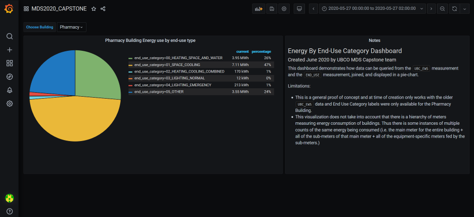
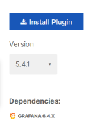
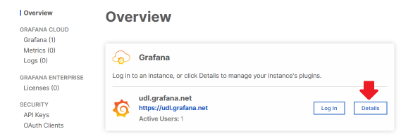

# Grafana Visualization of Energy Consumption By End-Use Category



1. [ Introduction ](#desc)
2. [ Grafana Setup ](#setup)
3. [ About the Flux Query ](#query)
4. [ Future Work For Query ](#future)

<a name="intro"></a>
# Introduction)   

The Grafana dashboard created to visualize energy consumption by end-use category for the Pharmacy building uses a simple pie-chart as the visualization. The focus of this document is on the setup of the data source in Grafana and the query used to retrieve the data for the pie-chart.

### Location of Dashboard   

The dashboard has been saved as **MDS2020_CAPSTONE** in UDL's grafana account: https://udl.grafana.net/d/4GlqacWGz/

A copy of the dashboard in .json format has been saved on this git repo under [visualization/grafana_MDS2020-CAPSTONE.json](grafana_MDS2020-CAPSTONE.json)

### Limitations of dashboard

Due to the calculations required to process the data, the influxDB server is only able to handle a query of ~2 weeks of data or ~6 million sensor records. Discussions on how to solve this limitation are in the **Future Improvements** section.   

&nbsp;  
&nbsp;  

<a name="setup"></a>
# Grafana Setup & Importing Dashboard)

Grafana can either be setup as a standalone service on a server/docker container by installing the open source Grafana software (https://grafana.com/oss/grafana/) or can be used through the commerical cloud-based implementation (https://grafana.com/products/cloud/). Note that a free-use tier exists for the cloud-based service and simply requires the user to make an account, login, and start a grafana instance. This free-tier limits the user to only 5 dashboards, 1 user account, and only the non-enterprise plugins. For the purpose of the MDS2020_CAPSTONE dashboard, the free-tier has all necessary features.

The current version of Grafana at time of writing is 7.0.3. The older 6.5.4 version was originally used to create earlier versions of this dashboard and will also work if the user doesn't/can't run the latest version.

Versions of various components used when creating this dashboard:

InfluxDB: `1.7.8` (with Flux enabled in the config file)   
Grafana: `7.0.3`   
Grafana influxdb Flux datasource: `5.4.1`   
Grafana pie-chart plugin: `1.5.0`   


### About Data Source

The dashboard is using the Flux language to interact with influxDB. As this language is still in beta (until the official release of influxDB V2.0), the Grafana plugin for using the language is ALSO in beta.

The data source has already been configured on the UDL dashboard but if transfering to a new server/account then the data source will need to be added again (i.e. the definition of the datasource isn't included in the .json export of the dashboard).

It is straight-forward to setup a data source in Grafana ([link](https://grafana.com/docs/grafana/latest/features/datasources/add-a-data-source/)) but to access the Flux plugin we need to do the additional step of adding the plugin. If using the cloud-based service it is as simple as clicking the "Install Plugin" button on the plugin's page while logged into your Grafana account: https://grafana.com/grafana/plugins/grafana-influxdb-flux-datasource
If using a non-cloud implementation (i.e. running grafana open source on a server or docker container), then follow the installation instructions on the plugin's web page.

#### **NOTE** It is highly recommended that you DO NOT use version 7.0.0 of the plugin. There are known issues with trying to connect to influxDB version 1.X. Instead use version 5.4.1. (if there is a newer version of the plugin than 7.0.0, you can try it. They may have fixed this bug



#### Setup the Data Source

Follow the add-a-data-source instructions above to add in a Flux data source. Name the data source `flux_SKYSPARK` (this is what the dashboard is expecting. If you create it with a different name, you may need to manually copy/paste the query back into the dashboard after pointing it to your custom-named data source)

Most of the default options are fine. You will need to update the following fields/sections:

- URL : `http://206.12.92.81:8086`   
- Turn on Basic auth   

Basic Auth Details   
- User: `public`   
- Password : `public`   

InfluxDB 2.0.0 Details   
- Organization : `my-org` (just a placeholder - actual value isn't too important when connecting to an InfluxDB versions 1.x)
- Default Bucket : `SKYSPARK`

Hit Save & Test (it may only give you a blue "TESTING" bar and not return to the main dashboard, that's ok. As long as it isn't a red error bar you are okay to exit back to the main dashboard and then move on to installing the pie-chart plugin)

### Add Pie-Chart Plugin

Grafana doesn't include the pie-chart as a default plugin, but it is available for free from Grafana Labs.

The plugin can be found [here](https://grafana.com/grafana/plugins/grafana-piechart-panel)

Instructures are the same as installing the data source plugin (if using Grafana Cloud). One way of navigating to the plugin page and installing is shown below.

Log into [Grafana Cloud](https://grafana.com/login) and navigate to the details of your Grafana instance ("details" button):



Click the Find More Plugins button to get a list of available plugins, click on the piechart plugin, and then click the Install button.


You may need to log out of grafana and log back in for the plugin to become active.

### Import a Dashboard   

To import the grafana_MDS2020-CAPSTONE.json file, go to Dashboards -> Manage (shown in screenshot below)


Click the blue "Import" button and then either upload the json file or copy paste the contents of the json file into the "Import via panel json" box. Then click the blue "Load" button.

MDS2020-CAPSTONE should now be listed in the dashboards.

***  

&nbsp;  
&nbsp;  

<a name="query"></a>
# About the Flux Query)  
### Notes on Flux
Details on how to enable and use Flux can be found on the [official influxDB documentation page](https://docs.influxdata.com/flux/v0.65/introduction/) on the topic.


**InfluxDB's default GUI software (Chronograf) is currently one of best ways to learn/write Flux code as it has text-completion features and is smarter than Grafana at handling situations where the user has inadvertently queried a huge amount of data. **


### Why Flux?

Due to the way the data is stored in influxDB, the older influxQL language couldn't be used to query and join the meter readings with the end-use categories. The issue primarily is that influxDB is designed for storing and working with time-series data. Trying to join records on something other than a time-stamp is problematic.

On the plus side, Flux will be the primary language for influxDB starting with version 2.0. It provides a much larger set of tools and functions than the older influxQL language. So transitioning to using Flux is helping setup for the future.

The query is made more complicated by the fact that at the time of writing, sensor/meter readings in the SKYSPARK database (EWS_UBC measurement) were not stored as numeric values. UDL was in the process of restructuring the database at the time of writing and a more efficient query should be able to be written when this is done. There are more notes on this in the **Future Work** section of this document.

### Overview of Query

The flux query has 5 basic steps:

1. Query all the sensors in `UBC_EWS` filtered on the user-defined date-range, user-defined building, values that only contain numbers.
2. Create a uniqueID for all of the sensors and convert the values to `float` data type
3. Calculate the difference between the minimum and maximum value for each sensor in the date-range queried.
4. Query all the end-use labels
5. Join the end-use labels with the sensor readings' difference between min/max values, group and sum the results

#### -step 1.

```
rawreadings=from(bucket: "SKYSPARK")
  |> range($range)
  |> filter(fn: (r) => r._measurement == "UBC_EWS" and
  r.siteRef == "$userSite" and
    r._value =~ /^[0-9]\d*(\.\d+)?$/)
```

For readers familar with SQL, the `from()` , `range()` and `filter` are usually used together in this format to do the same thing as a `SELECT <fields> FROM <database.table> WHERE <some criteria>` 

The 'bucket' refers to the database (in Influx 1.x you have databases and retention policies, in InfluxDB 2.x you have Buckets that representation a combination of those two things). In our case there is only a default retention policy for our database so we don't need to specify a specific rentenion policy.

The specific Flux functions are best read about in the official documentation but it is worth pointing out two Grafana dashboard variables that are being used in the query: `$range` and `$userSite`. The first is a "global" variable in Grafana that simply points at the selected date range on the dashboard. The `$userSite` is a variable that has been defined for the dashboard and points to a dropdown list for selecting a building. More on Grafana Dashboard variables can be read [here](https://grafana.com/docs/grafana/latest/variables/templates-and-variables/)

The `=~` expression tells the filter to only select things that match the Regular Expression (RegEx) on the right. In this case it is only matching values that may or may not start with a negative symbol and then have one or more digits and possibly a decimal point. Basically, every possible numeric value.

#### -step 2.
```
  |> map(fn: (r) => ({
    r with
    uniqueID: strings.replaceAll(v: r.equipRef + " "+r.groupRef+" "+r.navName+" "+r.typeRef,t: " "+r.siteRef+" ",u: " "),
    _value: float(v: r._value)
    }))
```	

The map function allows us to perform custom functions on columns of data. In this case we create a uniqueID by concatenating multiple identifying tags (leaving spaces between the values) and also to match the strategy used in the main python code, we remove all instances of the building name by doing a replaceAll on all instances of the `siteRef` value found in the uniqueID.

Next we have to "cast" the readings values from strings into floats so that the values can be aggregated, summarized, and visualized (which can not be done with strings).	

#### -step 3.   
```	
  |> group(columns: ["uniqueID"], mode:"by")
  |> drop(columns: ["equipRef", "groupRef","navName","siteRef","typeRef","unit","_measurement"])

mintable=rawreadings|> min()

maxtable=rawreadings|> max()

readings=join(tables: {mintbl: mintable, maxtbl: maxtable}, on: ["uniqueID"], method: "inner")
  |> map(fn: (r) => ({
    r with
    _value: r._value_maxtbl - r._value_mintbl
    }))

```

Next we get rid of unecessary columns of data and calculate tables of the minimum values for each of the sensors and a table of all the maximum values for each of the sensors. To find the difference between the maximum and minimum value for each sensor (i.e. the change in the reading of these sensors that measure cumulative energy use) we have to join the two tables together and use another map function to calculate the difference and store it in a new column.

#### -step 4.   
```
sdate = 2019-12-01T23:30:00
enduses=from(bucket: "SKYSPARK")
  |> range(start: sdate)
  |> filter(fn: (r) =>
  r._measurement == "END_USE")
```

This is similar to step 1 except it first defines a set start date-range for the selection. The reason for this because the end use category labels are stored with a constant timestamp of 2020-01-01T:00:00:00. By making the sure the query looks before this, it always captures the data. 


#### -step 5.   
```
join(
  tables: {reads:readings, euse:enduses},
  on: ["uniqueID"],
  method: "inner"
)
  |> rename(columns: {_value_reads: "_value", _value_euse: "end_use_category"})
  |> group(columns: ["end_use_category"], mode:"by")
  |> sum()
  |> yield()
```

The last step performs a join between the table of sensor readings and the end-use category labels for those sensors. It renames a few columns so the column names in the result make more sense. Finally it sums up the readings for each end-use category and outputs the results using the yield() function.

&nbsp;  
&nbsp;  

<a name="future"></a>
# Future Work For Flux Query)

#### -Use Updated Database Structure

UDL is in the process of updating the structure of SKYSPARK database in InfluxDB. Sensor readings are now being stored in `READINGS` instead of `UBC_EWS` and there are specific fields for each datatype. So now all numeric values can be found in `val_num` field, strings in `val_str`, and true/false values in `val_bool`. There is also a real `uniqueID` tag that ties the data to the `POINTS` measurement where descriptive information for each sensor can be found. This eliminates the need to do much of the computationally expensive parts of step 1 and step 2.

The python code that generates the end-uses will need to be updated to match the same `uniqueID` before this new query can be implemented. Specifically, the python code will need query and retain the `uniqueID` when it gathers data from the `READINGS` measurement as the input to the end-use classification model. Currently it creates its own `uniqueID` by concatenating several other fields.

**The updated Flux query would likely look something like the following:**

```
rawreadings=from(bucket: "SKYSPARK")
  |> range($range)
  |> filter(fn: (r) => r._measurement == "READINGS" and
  r.siteRef == "$userSite" and
  r._field == "val_num")
  |> group(columns: ["uniqueID"], mode:"by")
  |> drop(columns: ["equipRef", "groupRef","navName","siteRef","typeRef","unit","_measurement"])

mintable=rawreadings|> min()

maxtable=rawreadings|> max()

readings=join(tables: {mintbl: mintable, maxtbl: maxtable}, on: ["uniqueID"], method: "inner")
  |> map(fn: (r) => ({
    r with
    _value: r._value_maxtbl - r._value_mintbl
    }))
  
//query all the end use tags 
sdate = 2019-12-01T23:30:00
enduses=from(bucket: "SKYSPARK")
  |> range(start: sdate)
  |> filter(fn: (r) =>
  r._measurement == "END_USE")


//join end-use tags with readings, group by end use tags, and sum readings values
join(
  tables: {reads:readings, euse:enduses},
  on: ["uniqueID"],
  method: "inner"
)
  |> rename(columns: {_value_reads: "_value", _value_euse: "end_use_category"})
  |> group(columns: ["end_use_category"], mode:"by")
  |> sum()
  |> yield()
```

The query is basically the same as before but points at `READINGS` instead of `EWS_UBC` and instead of having to filter and convert the numberic values we can simply select directly from the field that stores only the numeric values in the new database structure `val_num`. Lastly, since the data in this new database structure now includes a uniqueID, the query no longer needs to create one.

#### -Use uniqueID from END_USE To Filter Sensors in Readings

Currently **_all_** Sensors in the READINGS measurement are queried in the user specified date range and user specified building. It should be possible to first query the sensors in the END_USE measurement and then use that as part of the query criteria for the READINGS query. This should greatly reduce the number of records queried and speed up processing. The way to do this seems to require the tableFind() and getColumn() functions as shown in the reply on this post:

https://community.influxdata.com/t/filter-tags-in-flux-query-based-on-results-in-another-table/13697

Initial attempts to implement this method were not working. Further investigation will be required. It is possible that the functionality isn't fully implemented in InfluxDB 1.7.8 and a newer version of InfluxDB will be needed to do this (i.e. may need to wait until the database is upgraded to version 2.0).

#### -Only Query information at Start and End

Take advantage of the cumulative nature of the data:

		Sensor A reads 1000kWh at startdate 
		Sensor A reads 5000kWh at enddate 
		Therefore the amount of energy used between startdate and enddate is 5000-1000=4000kWh.

So the query really only needs to pull the first and last day of data (assuming all sensors were operating on those two dates). 


#### -Investigate Usefulness of Creating a "Rolled-Up" Version of the Data

Most queries of energy consumption are likely interested in lower resolution than the data is currently stored at. For example, storing hourly average or daily readings in a separate measurement. This will increase storage requirements but decrease processing time for any queries that can use lower resolution data (i.e. only interested in daily readings). 

